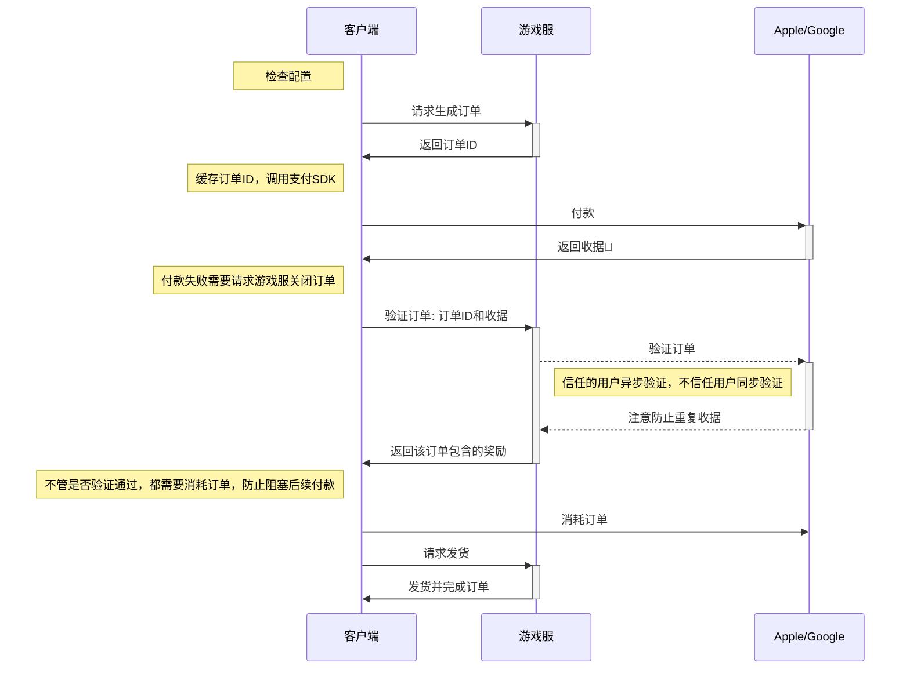
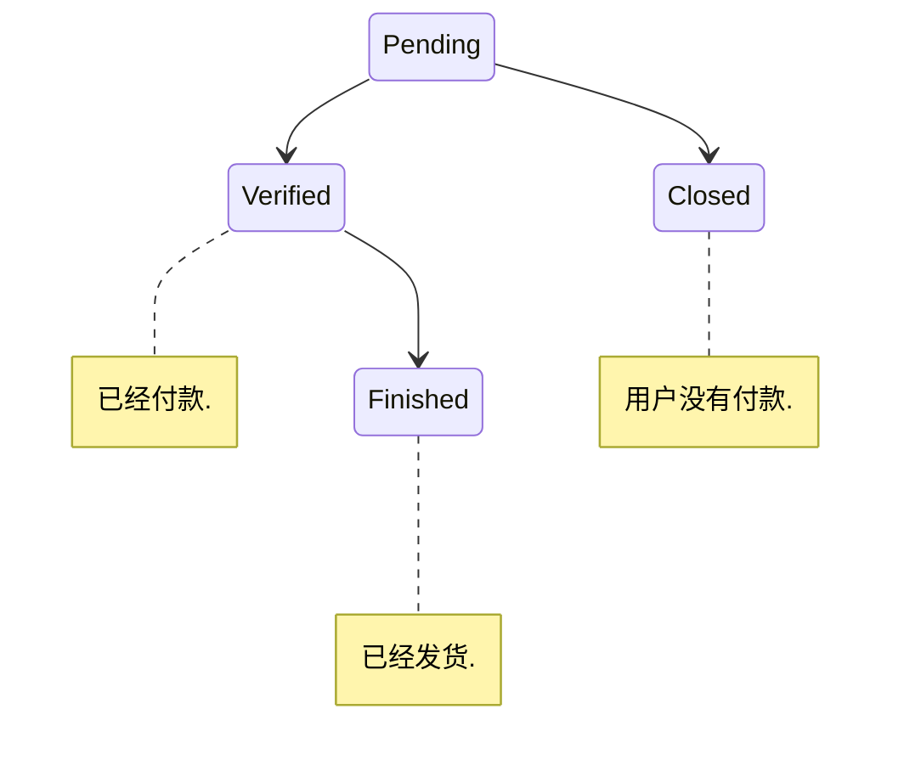

# 适合 GP 和 App Store 的内购系统

## 为什么要构建自己的订单系统
以 ios app-store 为例来说明必要性。
<!-- more -->

### 支付流程
1. 客户端向Appstore请求购买产品（假设产品信息已经取得），Appstore验证产品成功后，从用户的Apple账户余额中扣费。
2. Appstore向客户端返回一段receipt-data，里面记录了本次交易的证书和签名信息。
3. 客户端向我们可以信任的服务器提供receipt-data
4. 服务器对receipt-data进行一次base64编码
5. 把编码后的receipt-data发往itunes.appstore进行验证
6. itunes.appstore返回验证结果给服务器
7. 服务器对商品购买状态以及商品类型，向客户端发放相应的道具与推送数据更新通知

### 两个常规问题

#### 一、重复验证收据
客户端由于网络不稳定或者恶意而会重复验证同一个收据，如果没有自己的订单系统，则会导致服务端重复发送奖励

#### 二、漏单
客户端由于网络不稳定，付款成功了，没有把收据发给服务端，会导致用户损失奖励，并且会向客服投诉，如果没有自己的订单系统，则会无法定位用户这笔交易的信息，无法补发奖励

### 总结
我们必须有一个自建的订单系统，并且能够涵盖一笔交易的整个生命周期。

## 用户购买主流程分析
> 后端验证

## 订单状态机

## 信任机制

1. 初始化状态：IOS用户信任，安卓用户不信任
2. 信任->不信任：出现一笔无效或者重复的收据
3. 不信任->信任：连续验证成功3笔订单

## 自动补救流程

1. 客户端登录时异步获取Verified状态的订单列表(用户瞎JB操作或者网络不佳或者客户端崩溃或者服务端错误导致)
2. Finish订单

## 详细错误分析

1. 配置错误：策划紧急修复配置
2. 生成订单错误，客户端重试即可
3. 付款错误(不包含用户主动取消)：对客户端来说只能等待
4. 验证收据错误
   1. 客户端丢失订单ID，记录足够的信息，运营处理
   2. 第三方临时错误，IOS信任，依旧验证通过，Android抛错，客户端稍后重试
   3. 客户端网络错误，重试即可
   4. 订单状态错误，关闭/消耗该订单
   5. 收据重复使用，关闭/消耗该订单
   6. 无效的收据(可能是作弊)，关闭/消耗该订单
5. 消耗订单错误，重新验证即可

## 特殊情况分析

1. 客户端拿不到订单ID的情况；玩家必须删包或者清缓存才会出现，交由运营处理，否则后续细节太多
2. 单设备多账户的情况；A用户购买，未验证，B用户又在这台设备登录，按照客户端流程，B用户也会收到支付回调，但是需求上B用户不能Finish这笔订单，同时又不能阻塞B用户的接下来的付款，所以B用户必须验证并消耗这笔订单，这样就如同A用户验证了一样(未Finish)，然后B用户不回被阻塞，A用户重新上线之后走补救流程即可。
